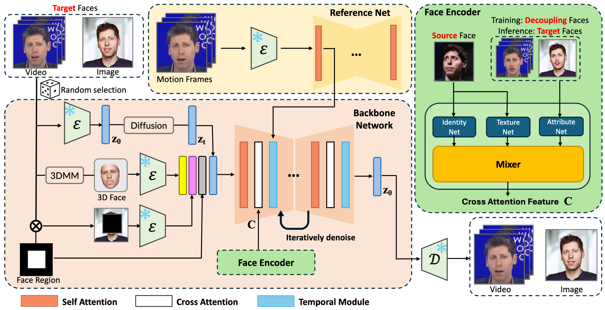

# VividFace: A Diffusion-Based Hybrid Framework for High-Fidelity Video Face Swapping

***“Revolutionize Video Face Swapping with Robost, Diffusion-Powered, Temporal Consistency-Driven Innovation!”*** 

This repository contains code for the paper [VividFace: A Diffusion-Based Hybrid Framework for High-Fidelity Video Face Swapping]().

**We will release the code soon!**

## License

All code within this repository is under [Apache License 2.0](https://www.apache.org/licenses/LICENSE-2.0).
